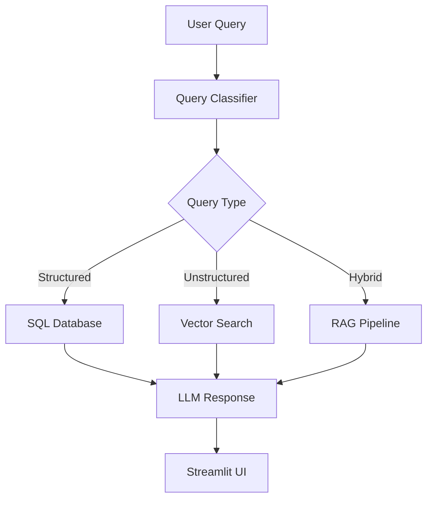

# Design Documentation

This document provides detailed technical information about the architecture, components, and design decisions of the Financial Data Copilot project.

## 🏗️ System Architecture

### Overview
The Financial Data Copilot implements a Retrieval-Augmented Generation (RAG) system that combines structured financial data with unstructured document analysis. The system is designed to handle three types of queries:
- **Structured**: Financial data queries (revenue, profits, etc.)
- **Unstructured**: Document analysis queries (risks, strategies, etc.)
- **Hybrid**: Queries requiring both data types

### Architecture Diagram

### Component Breakdown

#### 1. Data Ingestion Layer
- **Financial Data**: Ingested from Yahoo Finance API
- **Document Data**: Parsed from PDFs (10-Ks, annual reports) using LlamaParse
- **Storage**: PostgreSQL with pgvector extension for both structured and vector data

#### 2. Data Processing Layer
- **DBT Models**: Transform raw data into analysis-ready structures
- **Embedding Generation**: Convert document chunks to vector representations
- **Data Modeling**: Staging and mart models for financial analysis

#### 3. Query Processing Layer
- **Query Classification**: Determine query type (structured/unstructured/hybrid)
- **SQL Generation**: Convert natural language to SQL queries
- **Vector Search**: Find relevant document chunks for unstructured queries
- **Response Synthesis**: Combine information sources into coherent answers

#### 4. User Interface Layer
- **Streamlit Application**: Interactive dashboard for querying and visualization
- **Evidence Display**: Show supporting data (SQL queries, document excerpts)

## 🗄️ Database Schema

### Finance Schema
The database uses a `finance` schema with the following tables:

1. **companies**: Company information (symbol, name, sector, industry, market cap)
2. **financial_statements**: Financial data stored as JSONB for flexibility
3. **stock_prices**: Historical stock price data
4. **documents**: Parsed document content
5. **document_embeddings**: Vector representations of document chunks

### Key Design Decisions
- **JSONB for Financial Data**: Allows flexible storage of varying financial metrics
- **Vector Storage**: Enables semantic search on document content
- **Indexing**: Optimized indexes for performance on common query patterns

## 🤖 AI/ML Components

### Query Classification
Uses LangChain with OpenAI GPT models to classify queries into:
- STRUCTURED: Financial data queries
- UNSTRUCTURED: Document analysis queries
- HYBRID: Combined data queries

### Embedding Generation
Supports multiple embedding providers:
- **OpenAI**: text-embedding-3-small (1536 dimensions)
- **Hugging Face**: BAAI/bge-small-en (384 dimensions)

### Response Generation
- **Structured Queries**: SQL generation and execution with natural language formatting
- **Unstructured Queries**: Document retrieval and summarization
- **Hybrid Queries**: Combination of both approaches

## 🔄 Data Flow

1. **Ingestion**: Data from Yahoo Finance and PDF documents
2. **Processing**: DBT transformations and embedding generation
3. **Storage**: PostgreSQL with appropriate indexing
4. **Query**: Classification and routing to appropriate processing path
5. **Response**: Synthesis of information into natural language answers

## 🛠️ Technical Decisions

### Database Choice
- **PostgreSQL + pgvector**: Production-ready, extensible, supports both structured and vector data
- **JSONB for Financials**: Flexible schema for varying financial statement formats

### Orchestration
- **Docker Compose**: Simplifies deployment and ensures consistency
- **DBT**: Industry-standard for data transformation

### LLM Integration
- **LangChain**: Mature framework for LLM orchestration
- **OpenAI**: High-quality models for generation and embedding

### Document Processing
- **LlamaParse**: Specialized for complex document parsing
- **Chunking Strategy**: Optimized for financial document structure

## 📈 Performance Considerations

### Database Optimization
- Indexes on commonly queried columns
- Vector indexes for similarity search
- Connection pooling for concurrent queries

### Caching
- LLM response caching for common queries
- Embedding caching to avoid recomputation

### Scalability
- Horizontal scaling possible with read replicas
- Vector database sharding for large document collections
