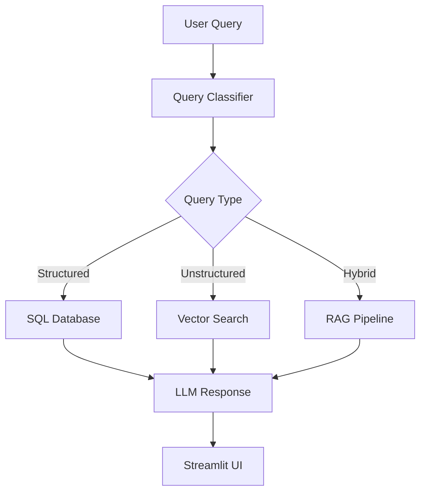

# Financial Data Copilot

An AI-powered assistant for analyzing financial data and documents of the top companies. This project demonstrates expertise in LLMs, GenAI, RAG, data engineering, and orchestration tools.

## 📊 Project Overview

The Financial Data Copilot ingests structured financial data (stock prices, financial statements) and unstructured data (annual reports, 10-Ks, ESG disclosures) for the top companies by market cap. Users can ask natural language questions like:

- "What were Apple's main risks in 2023?"
- "Compare Tesla vs Microsoft revenue growth in the last 5 years."
- "Summarize ESG commitments of Amazon."

## 🏗️ Architecture



## 🚀 Quick Start

1. **Clone the repository:**
   ```bash
   git clone <repository-url>
   cd llm-finance
   ```

2. **Set up environment variables:**
   ```bash
   cp configs/example.env .env
   # Edit .env with your API keys and configuration
   ```

3. **Start the services:**
   ```bash
   docker-compose up -d
   ```

4. **Access the application:**
   Open `http://localhost:8501` in your browser

## 📁 Project Structure

```
llm-finance/
├── configs/                 # Configuration files
├── data/                    # Data storage (gitignored)
├── infra/                   # Infrastructure scripts
├── models/                  # DBT models for data transformation
├── notebooks/               # Jupyter notebooks for analysis
├── src/                     # Source code
│   ├── data_ingestion.py    # Financial data ingestion
│   ├── document_parser.py   # PDF parsing and processing
│   ├── embedding_processor.py # Document embedding generation
│   ├── query_classifier.py  # Query classification
│   └── rag_pipeline.py      # RAG pipeline implementation
├── streamlit_app.py         # Streamlit UI application
├── embeddings.py           # Embedding provider abstraction
├── requirements.txt         # Python dependencies
├── docker-compose.yml       # Docker services configuration
├── Dockerfile.dbt           # DBT service Dockerfile
├── Dockerfile.streamlit     # Streamlit service Dockerfile
├── dbt_project.yml          # DBT project configuration
└── profiles.yml            # DBT profiles configuration
```

## 🔧 Setup Instructions

### Prerequisites

- Docker and Docker Compose
- Python 3.8+
- API keys for:
  - OpenAI (for embeddings and LLM)
  - LlamaParse (for document parsing)

### Environment Configuration

1. Copy the example environment file:
   ```bash
   cp configs/example.env .env
   ```

2. Edit `.env` with your configuration:
   - Add your OpenAI API key
   - Add your LlamaParse API key
   - Adjust database credentials if needed

### Database Setup

The database is automatically initialized when starting the services with Docker Compose. The initialization script creates:

- Tables for companies, financial statements, stock prices, documents, and embeddings
- Vector extension for similarity search
- Indexes for performance optimization

### Data Ingestion

To ingest financial data:

```bash
# Run data ingestion
docker-compose run --rm dbt python src/data_ingestion.py
```

This will:
- Fetch company information from Yahoo Finance
- Download financial statements (income statements, balance sheets, cash flow)
- Retrieve historical stock prices

Note: Some financial data may contain NaN values which are automatically handled by converting them to NULL in the database.

## 📄 PDF Document Processing

### PDF Sources

You can obtain financial documents from several sources:

1. **SEC EDGAR Database** (Free)
   - Website: https://www.sec.gov/edgar/searchedgar/companysearch
   - Contains 10-Ks, 10-Qs, 8-Ks, and other filings

2. **Company Websites**
   - Most companies publish annual reports on their investor relations websites

3. **Kaggle Datasets**
   - Search for "financial reports" or "annual reports" on https://www.kaggle.com/datasets

### Directory Structure

The processing script expects PDFs in the `data/sec_filings/` directory with filenames in the format `SYMBOL_10K_YEAR.pdf`:

```
llm-finance/
├── data/
│   ├── sec_filings/
│   │   ├── AAPL_10K_2023.pdf
│   │   ├── MSFT_10K_2023.pdf
│   │   ├── GOOGL_10K_2023.pdf
│   │   └── ...
```

### Processing Documents

After downloading PDFs, process them with:

```bash
# Process PDF documents
docker-compose run --rm dbt python src/process_pdfs.py

# Generate embeddings for processed documents
docker-compose run --rm dbt python src/embedding_processor.py
```

The `src/process_pdfs.py` script automatically processes all PDFs in the `data/sec_filings/` directory that match the naming convention `SYMBOL_10K_YEAR.pdf`.

## 🔄 DBT Data Modeling

This project uses DBT for data transformation:

- Staging models in `models/staging/`
- Mart models in `models/marts/`
- Run DBT models:
  ```bash
  docker-compose run --rm dbt dbt run
  ```

## 🤖 Embedding Providers

The project supports switching between embedding providers:

- **OpenAI** (default): `text-embedding-3-small` (1536 dimensions)
- **Hugging Face**: `BAAI/bge-small-en` (384 dimensions)

To switch providers, modify the `EMBEDDING_PROVIDER` variable in your `.env` file.

## 📈 Streamlit UI

The Streamlit application provides an interactive interface for querying financial data:

- Natural language query input
- Evidence display (SQL queries, document excerpts)
- Example queries for quick start

## 📚 Example Queries

Try these example queries in the Streamlit UI:

1. "What was Apple's revenue in 2023?"
2. "What were Apple's main risks in 2023?"
3. "Compare Tesla vs Microsoft revenue growth in the last 5 years."
4. "Summarize ESG commitments of Amazon."
5. "Which company had the highest profit margin in 2023?"

## 🛠️ Technologies Used

- **Database**: PostgreSQL with pgvector extension
- **Data Modeling**: DBT (Data Build Tool)
- **LLM Orchestration**: LangChain + LangGraph
- **Document Parsing**: LlamaParse
- **Embeddings**: OpenAI API / Hugging Face Sentence Transformers
- **Frontend**: Streamlit
- **Infrastructure**: Docker + Docker Compose

## 📖 Documentation

For more detailed information, see these documentation files:

- [Design Documentation](DESIGN.md) - Technical architecture and design decisions
- [Future Improvements](FUTURE.md) - Advanced techniques like SFT and RLHF

## 🤝 Contributing

1. Fork the repository
2. Create a feature branch
3. Commit your changes
4. Push to the branch
5. Create a Pull Request

## 📄 License

This project is licensed under the MIT License - see the [LICENSE](LICENSE) file for details.

## 🙏 Acknowledgments

- Financial data from Yahoo Finance
- SEC filings from EDGAR database
- OpenAI for LLM and embedding APIs
- LlamaIndex for document parsing
- DBT for data transformation
